# 데이터통신 정리

**Behrouz A.Forouzan의 "*Data Communications and Networking*" 참고**

## Introduction

### Protocols
메시지 송수신 컨트롤
* 송수신 규격을 정함
* 송수신 순서를 정함
* 송수신 방법을 정함

### Internet
Network of networks, 네트워크들의 네트워크

### Network Edge
어플리케이션, 호스트 (PC등)
* End system
* 클라이언트/서버 모델
* peer-to-peer (P2P) 모델

### Network Core
라우터, 인터넷

### Data Communication
전송 미디어를 통해 두 디바이스 간에 데이터를 주고 받는것

* Component
  * Protocol (프로토콜)
  * Message (메시지)
  * Sender (송신자)
  * Receiver (수신자)
  * Transmission medium (전송 통로)

* 데이터 표현
  * 숫자, 텍스트, 오디오, 비디오 등

* Data Flow
  * Simplex = 단방향
  * Half-duplex = 무전기
  * Full-duplex = 전화

### Networks
커뮤니케이션 가능한 기기들간의 연결
* PC, 라우터, 모뎀, 핸드폰 모두 가능

* Network Criteria
  * Performance (성능)
  * Reliability (신뢰성)
  * Security (안전성)

* 물리적 구조
  * Point-to-Point : 두 디바이스가 링크 하나로 서로 연결
  * Multipoint : Bus 형태로, 여러 디바이스가 하나의 링크에 연결
  * Fully-connected : 서로 모든 디바이스가 링크로 연결
  * Star topology : 하나의 허브를 통해 연결
  * Ring topology : 링크가 원형으로 있고 여기에 디바이스가 연결

### Network Types
* LAN (Local Area Network)
  * 지역적 네트워크 (가정, 회사 등)
  * 각 디바이스가 유일한 Address 가짐
  * Host에 연결됨
  * 과거에는 Bus 형태이지만 최근에는 Switch에 연결 (공유기 등)
  * 영역과 영역을 넘나 들 때는 Router나 Gateway 거쳐야함 (각각 영역의 LAN은 Isolate 되었다고 표현)

* WAN (Wide Area Network)
  * LAN보다 훨씬 넓은 의미의 네트워크 (지역, 도시, 국가)
  * 스위치나 라우터, 모뎀 등이 서로 연결됨
  * Network와 Network 사이의 연결
  * LAN과 LAN이 WAN으로 연결 가능
  * Switched WAN (스위치를 통한 WAN), Router to Router, Modem, LAN 등이 서로 연결 가능

* Switching
  * 인터넷은 스위치로 구성되었고 스위치는 최소 2개의 링크를 가짐
  * 스위치는 하나의 네트워크에서 다른 네트워크로 데이터를 포워딩해줌
  * Circuit-switched Network : 스위치에 여러 기기들이 연결되어 있고, 큰 Capacity를 가진 하나의 전선이 스위치끼리 연결해줌
  * Packet-switched Network : 위와 형태는 같지만 스위치 대신 라우터가 있고 라우터가 패킷을 보내줌
* Internet
  * 여러 네트워크들의 네트워크
  * ISP (Interenet Service Provider) : 인터넷 서비스 제공사업자
  * 거대한 백본 네트워크에 ISP들의 네트워크가 연결되고, ISP들의 네트워크에 소비자 네트워크가 연결됨

## Network Models

### Protocol Layering
Protocol은 송수신자 사이 혹은 기기들 사이의 커뮤니케이션을 효율적으로 하기위한 룰을 정의함. 커뮤니케이션 방법이 간단하지 않기 때문에 여러 레이어로 나눠서 처리함.

* Single-layer protocol
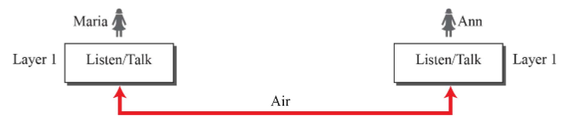

* Three-layer Protocol
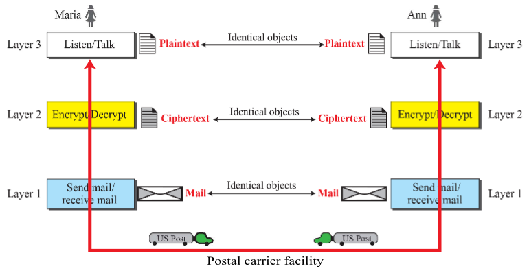

* Logical connection between peer layers
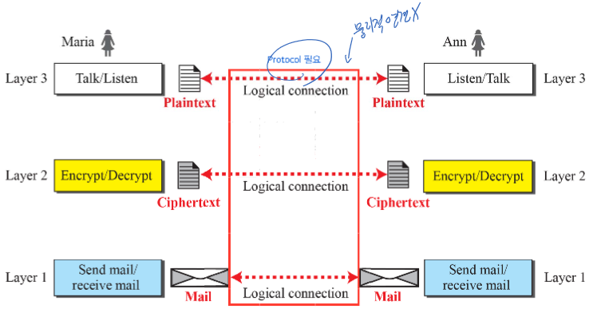

### TCP/IP Protocol Suite

* Layers in the TCP/IP protocol Suite

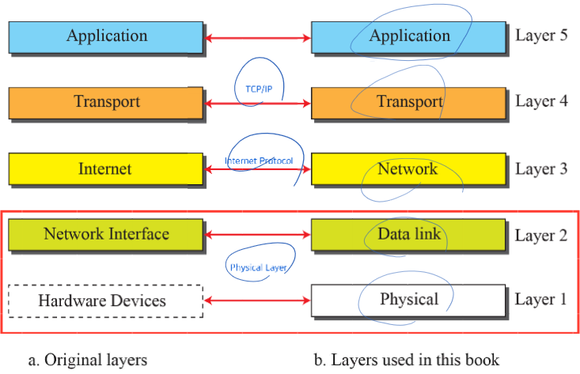

* Communication through an Internet

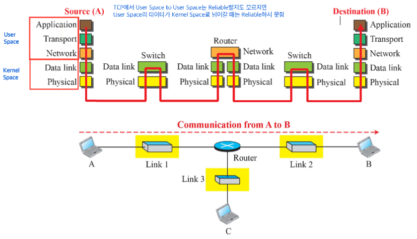

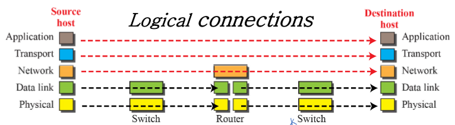

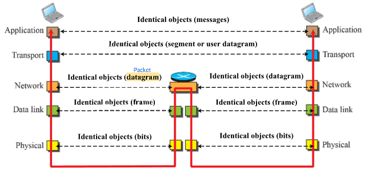

#### Encapsulation / Decapsulation

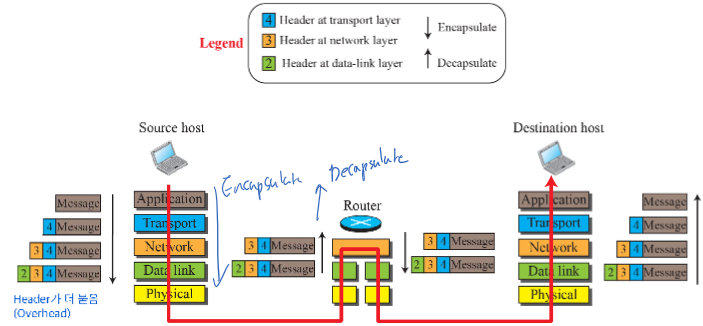

#### Addressing

|Packet names|Layers|Address|
|--:|:--:|:--|
|Message|Application Layer|Names|
|Segment/User datagram|Transport Layer|Port numbers|
|Datagram|Network Layer|Logical addresses(IP)|
|Frame|Data-link Layer|Link-layer addresses|
|Bits|Physical Layer||

#### Multiplexing / Demultiplexing
여기서 멀티플렉싱은 상위 레이어의 프로토콜을 패킷으로 캡슐화하는 프로토콜이고 디멀티플렉싱은 반대의 의미

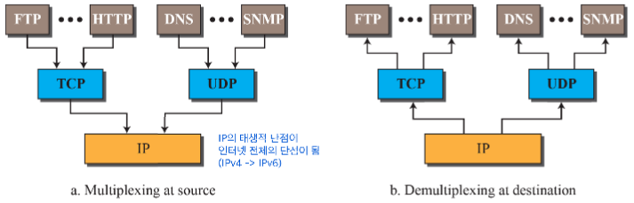

### OSI Model
Application, Presentation, Session은 Application 레이어 하나로 봐도 무방함

|Layer|Name|
|-------|-----------|
|Layer 7|**Application**|
|Layer 6|Presentation|
|Layer 5|Session|
|Layer 4|**Transport**|
|Layer 3|**Network**|
|Layer 2|**Data Link**|
|Layer 1|**Physical**|

## Introduction to Physical Layer

### Data and Signals

* Communication at the physical layer
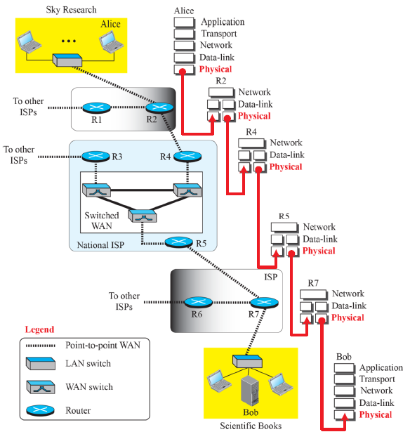

#### Analog / Digital Data
Analog 데이터란 연속된(Continuous) 데이터이고, Digital 데이터란 불연속(Discrete) 데이터. Analog와 Digital 신호도 이와 유사, Analog 신호은 수많은 파장의 세기로 구성되어있고 연속된 값을 가질 수 있으며, Digital 신호에선 정해진 몇 가지의 값만 가질 수 있음
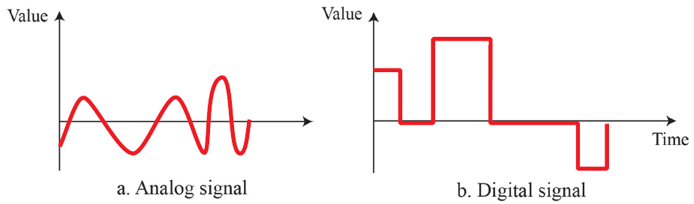

#### Periodic / Nonperiodic
주기성을 가지는 신호, 가지지 않는 신호
* Cycle : 주기성을 가지는 신호의 반복되는 패턴

### Periodic Analog Signals

#### 사인파
* 진폭(Peak amplitude) : 최대 변위 크기
* 파장(Wavelength) : 한 주기 동안 진행한 거리
* 주기(Phase) : 한 점이 1회 진동하는데 걸리는 시간
* 진동수(Frequency) : 1초 동안 진동 횟수

#### Time / Frequency Domains
* 시간 도메인, 진동수 도메인 나눠서 생각 가능
 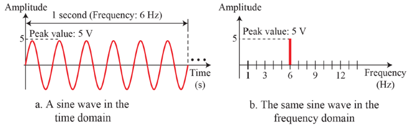

#### Composite Signals
여러 신호이 합쳐질 수 있음
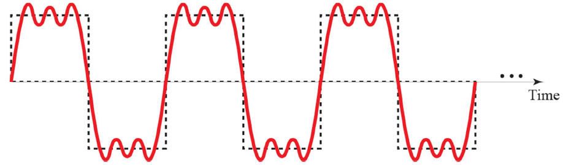
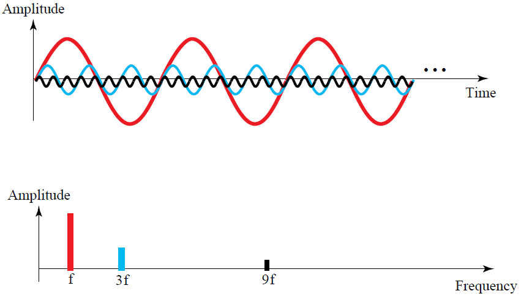

#### Bandwidth
Composite Signal에서 진동수의 범위

### Digital Signals
디지털 신호로도 데이터 전송 가능
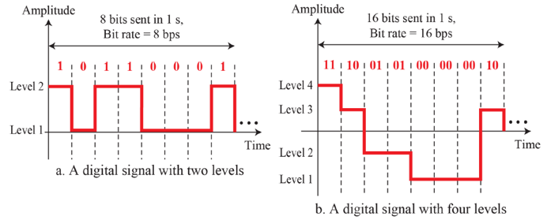

#### Bit Rate
진동수 대신 비트레이트 사용, 초당 몇 비트 전송 가능한지

#### Bit Wavelength
한 비트 당 Transmission medium에서 전송되는 거리
**$$Bit\ length = Propagation\ speed \times bit\ duration$$**

#### Digital as Composite Analog
디지털 신호를 아날로그 신호의 결합으로 볼 수 있음 (Bandwidth = 0 ~ *inf*)
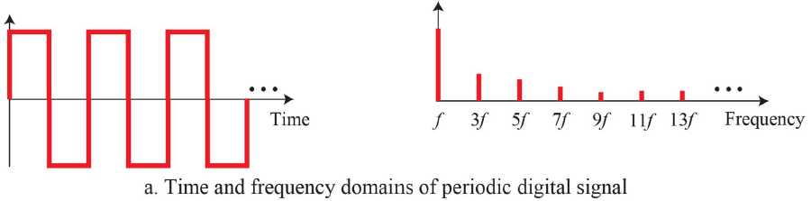

#### Transmission of Digital Signals
* Basebnad Transmission
  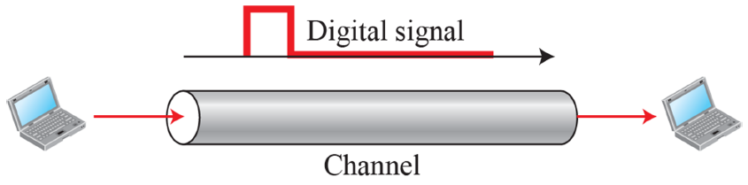

* Bandwidth of two low-pass channels
  * Bandwidth 사이의 주기를 가진 신호만 걸러줌
    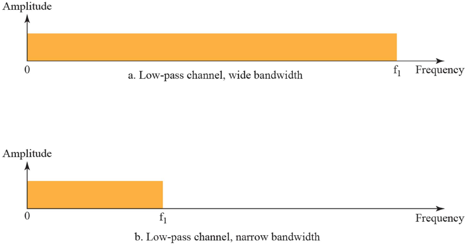

### Transmission Impairment (전송 장애)
수신 데이터와 전달 매체를 통해서 전달된 데이터가 다를 수 있음
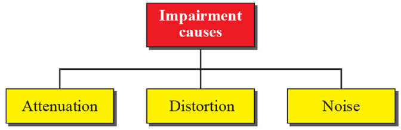

#### Attenuation (신호 감소)
* 신호가 에너지를 잃어서 일어나는 장애
* 중간에 증폭기(Amplifier)를 달아서 해결
  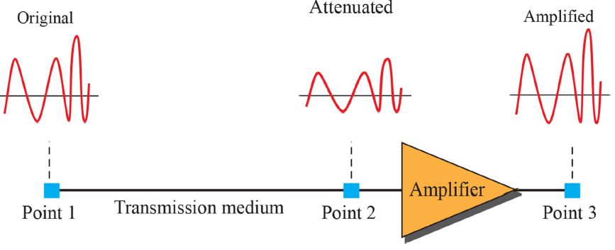

#### Distortion (신호 왜곡)
* 디지털 신호는 서로 다른 주파수를 가진 신호가 결합해서 만들어지는데 이 때 신호들의 속도 차이로 왜곡이 발생
  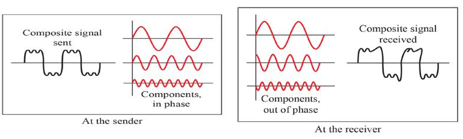

#### Noise (노이즈)
전달 매체의 열이나, 신호의 혼선으로 인해 노이즈 발생

## Digital Transmission

### Digital-to-Digital Conversion

#### Line Coding
디지털 데이터를 디지털 신호로 바꾸는 프로세스
* 디지털 데이터(비트)를 신호로 바꿈
* 받는 쪽에서는 디지털 신호를 디지털 데이터로 바꿈
* 주는쪽과 받는쪽의 Synchronization 필요 (동기화 안되면 잘 못 받을 수 있음)
